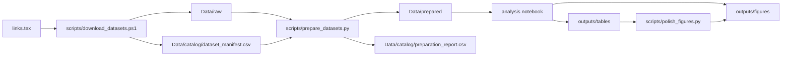
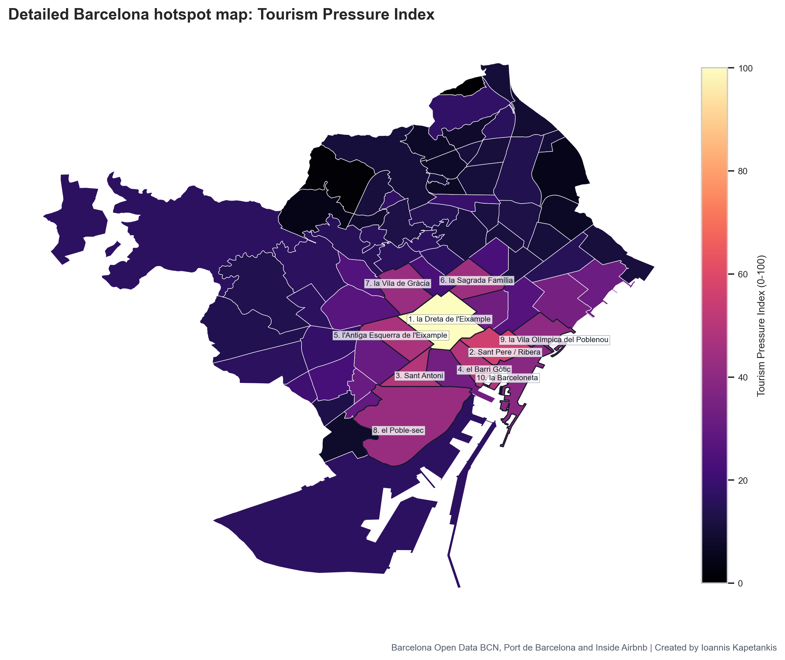
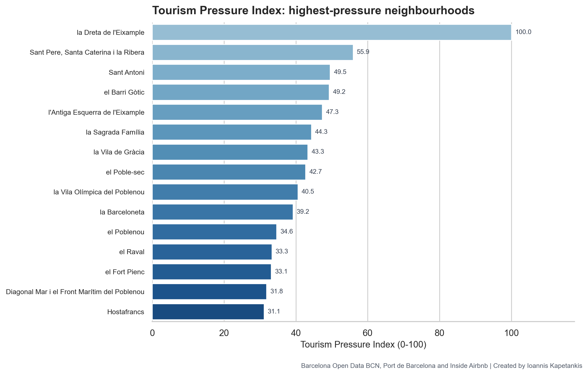
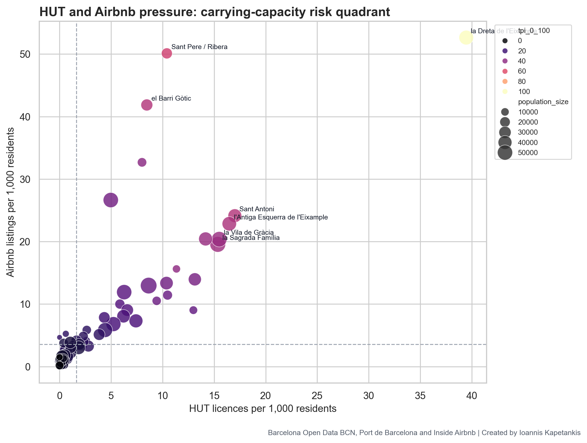
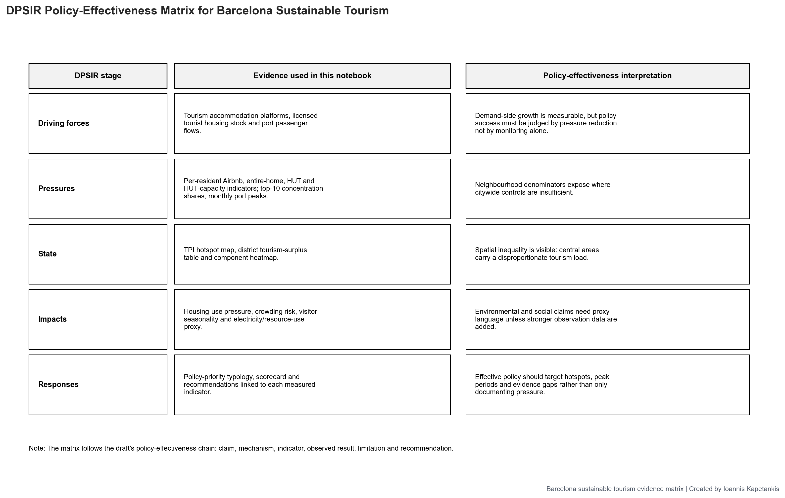

# Barcelona Sustainable Tourism Pressure Analysis

Technical repository for a data-driven analysis of tourism pressure, accommodation concentration, port seasonality, resource-use proxies and spatial inequality in Barcelona.

[](https://www.python.org/)
[](notebooks/barcelona_tourism_sustainability_analysis.ipynb)
[](https://pandas.pydata.org/)
[](outputs/figures/)

## Quick Links

| Item | Link |
|---|---|
| Main notebook | [notebooks/barcelona_tourism_sustainability_analysis.ipynb](notebooks/barcelona_tourism_sustainability_analysis.ipynb) |
| Download script | [scripts/download_datasets.ps1](scripts/download_datasets.ps1) |
| Preparation script | [scripts/prepare_datasets.py](scripts/prepare_datasets.py) |
| Figure polish script | [scripts/polish_figures.py](scripts/polish_figures.py) |
| Data folder guide | [Data/README.md](Data/README.md) |
| Output figures | [outputs/figures/](outputs/figures/) |
| Output tables | [outputs/tables/](outputs/tables/) |

## What This Project Does

This repository is mainly a reproducible analysis workflow. It:

1. Reads source URLs from [links.tex](links.tex).
2. Downloads Barcelona tourism, platform accommodation, population, port and environmental datasets into `Data/raw/`.
3. Creates a file-level manifest at [Data/catalog/dataset_manifest.csv](Data/catalog/dataset_manifest.csv).
4. Extracts, validates and normalises raw files into `Data/prepared/`.
5. Loads prepared files in the notebook.
6. Builds neighbourhood, district, temporal and proxy indicators.
7. Exports analysis-ready CSV tables to [outputs/tables/](outputs/tables/).
8. Exports publication-style figures to [outputs/figures/](outputs/figures/).



## Short Paper Teaser

The linked paper uses these outputs to ask whether Barcelona's sustainable tourism management reduces measurable pressure or mainly documents it. The full argument belongs in the essay; this README only gives enough context to understand the technical outputs.

| Tourism Pressure Index map | Highest-pressure neighbourhoods |
|---|---|
|  |  |

| Accommodation overlap | Policy-effectiveness chain |
|---|---|
|  |  |

## Repository Structure

| Path | Type | What it does |
|---|---|---|
| [links.tex](links.tex) | Source list | Stores dataset URLs used by the downloader. |
| [Data/README.md](Data/README.md) | Data documentation | Explains raw, prepared and catalog folder layout. |
| `Data/raw/` | Ignored local data | Original downloaded source files. Kept out of Git because raw data can be large or sensitive. |
| `Data/prepared/` | Ignored local data | Validated/extracted files used by the notebook. Large prepared CSVs are kept out of Git. |
| [Data/catalog/dataset_manifest.csv](Data/catalog/dataset_manifest.csv) | Data catalogue | Download manifest with source group, dataset id, resource id, source URL, final URL, path and size. |
| [Data/catalog/preparation_report.csv](Data/catalog/preparation_report.csv) | Data QA table | File-level preparation status, output path, inferred type and validation detail. |
| [Data/catalog/preparation_summary.json](Data/catalog/preparation_summary.json) | Data QA summary | Counts of raw files, prepared files, status values and source groups. |
| [notebooks/barcelona_tourism_sustainability_analysis.ipynb](notebooks/barcelona_tourism_sustainability_analysis.ipynb) | Main analysis | Loads prepared data, constructs indicators, exports tables and figures. |
| [scripts/download_datasets.ps1](scripts/download_datasets.ps1) | Downloader | Parses `links.tex`, downloads files, resolves Open Data BCN filenames and writes the manifest. |
| [scripts/prepare_datasets.py](scripts/prepare_datasets.py) | Preparation | Copies, extracts, normalises and validates CSV, JSON and GeoJSON files. |
| [scripts/polish_figures.py](scripts/polish_figures.py) | Figure utility | Regenerates polished versions of selected figures from exported tables. |
| [outputs/tables/](outputs/tables/) | Analysis outputs | CSV outputs used for figures, appendix tables and evidence checks. |
| [outputs/figures/](outputs/figures/) | Visual outputs | PNG maps, charts, heatmaps and matrices exported by the analysis. |

## Data Preparation Status

The current preparation summary reports:

| Metric | Value |
|---|---:|
| Raw files in manifest | 53 |
| Prepared files written | 53 |
| Successful preparation records | 53 |
| Barcelona Open Data files | 40 |
| Inside Airbnb files | 7 |
| Port de Barcelona files | 6 |

The preparation script validates files using lightweight checks:

| File type | Validation performed |
|---|---|
| CSV | Detect delimiter, check header, check at least one data row. |
| JSON | Parse JSON and count top-level items. |
| GeoJSON | Check valid GeoJSON root type and count features. |
| ZIP | Check archive integrity and reject unsafe member paths before extraction. |
| GZIP | Decompress, normalise text line endings and validate extracted file. |

## Main Analysis Inputs

The notebook combines prepared files into analysis datasets. The current overview table contains these analysis inputs:

| Dataset | Rows | Columns | Date coverage or role |
|---|---:|---:|---|
| Inside Airbnb listings | 18,177 | 29 | Listings snapshot with district/neighbourhood harmonisation. |
| Inside Airbnb calendar | 6,634,623 | 7 | Availability and price dates from 2025-12-14 to 2026-12-14. |
| Inside Airbnb reviews | 991,795 | 2 | Review dates from 2010-10-03 to 2025-12-14. |
| Inside Airbnb neighbourhoods | 73 | 2 | Airbnb neighbourhood lookup. |
| HUT licences | 248,766 | 58 | Licensed tourist-housing records and quarterly source snapshots. |
| Port passengers | 2,042 | 24 | Monthly passenger records from 2019-01 to 2025-12. |
| Electricity consumption | 1,665,130 | 13 | Postcode electricity records from 2019-01-01 to 2025-11-30. |
| Air quality stations | 320 | 29 | Monitoring station metadata and geographic coverage. |
| Air quality pollutants | 21 | 6 | Pollutant lookup table. |
| Population denominators | 511 | 8 | District/neighbourhood resident population denominators. |

## Key Technical Indicators

These formulas are implemented in the notebook and exported through the output tables:

```text
Airbnb pressure = Airbnb listings / resident population x 1,000

Entire-home Airbnb pressure = entire-home listings / resident population x 1,000

HUT pressure = HUT licences / resident population x 1,000

HUT capacity pressure = HUT places / resident population x 1,000

Tourism-unit share = local tourism units / city tourism units

Population share = local population / city population

Tourism-unit surplus = tourism-unit share - population share

Tourism Pressure Index = standardised pressure-component score rescaled from 0 to 100

Port peak pressure ratio = peak monthly passengers / average monthly passengers
```

## Output Tables

| Table | What it contains |
|---|---|
| [analysis_dataset_overview.csv](outputs/tables/analysis_dataset_overview.csv) | Row counts, column counts, missingness, date coverage and field names for analysis datasets. |
| [dataset_inventory.csv](outputs/tables/dataset_inventory.csv) | Inventory of local datasets and source groups used by the notebook. |
| [top_tpi_neighbourhoods.csv](outputs/tables/top_tpi_neighbourhoods.csv) | Highest Tourism Pressure Index neighbourhoods with population, Airbnb, HUT and pressure values. |
| [top_airbnb_neighbourhoods.csv](outputs/tables/top_airbnb_neighbourhoods.csv) | Neighbourhoods ranked by Airbnb pressure per 1,000 residents. |
| [top_hut_neighbourhoods.csv](outputs/tables/top_hut_neighbourhoods.csv) | Neighbourhoods ranked by licensed tourist-housing pressure per 1,000 residents. |
| [district_pressure_summary.csv](outputs/tables/district_pressure_summary.csv) | District-level pressure summary for listings, HUT licences, HUT places and population. |
| [district_spatial_inequality.csv](outputs/tables/district_spatial_inequality.csv) | District tourism-unit share, population share and tourism surplus/deficit. |
| [concentration_diagnostics.csv](outputs/tables/concentration_diagnostics.csv) | Concentration shares and inequality diagnostics for accommodation pressure. |
| [tpi_component_profile.csv](outputs/tables/tpi_component_profile.csv) | Component-level values used to explain the Tourism Pressure Index. |
| [airbnb_room_type_by_district.csv](outputs/tables/airbnb_room_type_by_district.csv) | Airbnb room-type composition by district. |
| [port_recovery_index.csv](outputs/tables/port_recovery_index.csv) | Annual passenger totals and recovery index values. |
| [port_peak_pressure.csv](outputs/tables/port_peak_pressure.csv) | Monthly peak-pressure ratios for port passenger data. |
| [electricity_index.csv](outputs/tables/electricity_index.csv) | Electricity-consumption index values used as a resource-use proxy. |
| [top_electricity_postcodes.csv](outputs/tables/top_electricity_postcodes.csv) | Highest electricity-consumption postcodes in the processed data. |
| [policy_indicator_matrix.csv](outputs/tables/policy_indicator_matrix.csv) | Technical mapping from policy area to indicator, observed signal, limitation and recommendation. |
| [policy_evidence_scorecard.csv](outputs/tables/policy_evidence_scorecard.csv) | Short scorecard linking draft claims to indicator evidence and policy reading. |
| [policy_priority_typology.csv](outputs/tables/policy_priority_typology.csv) | Neighbourhood/district categorisation for priority targeting. |
| [method_notes_and_limitations.csv](outputs/tables/method_notes_and_limitations.csv) | Method notes, assumptions and data limitations. |
| [generated_figure_index.csv](outputs/tables/generated_figure_index.csv) | List of figures generated by the analysis workflow. |

## Output Figures

| Figure | What it shows |
|---|---|
| [01_tpi_top_neighbourhoods.png](outputs/figures/01_tpi_top_neighbourhoods.png) | Bar chart ranking the highest Tourism Pressure Index neighbourhoods. |
| [02_airbnb_pressure_top_neighbourhoods.png](outputs/figures/02_airbnb_pressure_top_neighbourhoods.png) | Top neighbourhoods by Airbnb listings per 1,000 residents. |
| [03_hut_pressure_top_neighbourhoods.png](outputs/figures/03_hut_pressure_top_neighbourhoods.png) | Top neighbourhoods by HUT licences per 1,000 residents. |
| [04_tpi_choropleth.png](outputs/figures/04_tpi_choropleth.png) | Neighbourhood map of the composite Tourism Pressure Index. |
| [05_airbnb_pressure_choropleth.png](outputs/figures/05_airbnb_pressure_choropleth.png) | Neighbourhood map of Airbnb pressure. |
| [06_hut_pressure_choropleth.png](outputs/figures/06_hut_pressure_choropleth.png) | Neighbourhood map of licensed tourist-housing pressure. |
| [07_policy_priority_typology_map.png](outputs/figures/07_policy_priority_typology_map.png) | Spatial typology for policy-priority targeting. |
| [08_hut_vs_airbnb_scatter.png](outputs/figures/08_hut_vs_airbnb_scatter.png) | Scatterplot comparing HUT pressure with Airbnb pressure. |
| [09_tpi_component_heatmap.png](outputs/figures/09_tpi_component_heatmap.png) | Heatmap of pressure components behind the TPI ranking. |
| [10_district_spatial_inequality.png](outputs/figures/10_district_spatial_inequality.png) | District tourism-unit surplus or deficit compared with population share. |
| [11_district_pressure_heatmap.png](outputs/figures/11_district_pressure_heatmap.png) | District-level pressure component heatmap. |
| [12_concentration_lorenz_curve.png](outputs/figures/12_concentration_lorenz_curve.png) | Lorenz-style concentration curve for tourism accommodation distribution. |
| [13_airbnb_room_type_by_district.png](outputs/figures/13_airbnb_room_type_by_district.png) | Airbnb room-type composition by district. |
| [14_port_recovery_and_cruise_share.png](outputs/figures/14_port_recovery_and_cruise_share.png) | Port passenger recovery index and annual passenger scale. |
| [15_port_monthly_seasonality_heatmap.png](outputs/figures/15_port_monthly_seasonality_heatmap.png) | Month-by-year heatmap of port passenger seasonality. |
| [16_port_peak_pressure_ratio.png](outputs/figures/16_port_peak_pressure_ratio.png) | Peak-to-average monthly passenger pressure ratio. |
| [17_electricity_consumption_index.png](outputs/figures/17_electricity_consumption_index.png) | Indexed electricity-consumption trend used as a proxy indicator. |
| [19_hut_quarterly_trend.png](outputs/figures/19_hut_quarterly_trend.png) | Quarterly trend in HUT records. |
| [20_air_quality_monitoring_coverage.png](outputs/figures/20_air_quality_monitoring_coverage.png) | Coverage of air-quality monitoring metadata. |
| [21_policy_priority_summary.png](outputs/figures/21_policy_priority_summary.png) | Summary of policy-priority categories. |
| [22_dpsir_policy_effectiveness_chain.png](outputs/figures/22_dpsir_policy_effectiveness_chain.png) | DPSIR-style technical chain linking drivers, pressures, state, impacts and responses. |

## How To Reproduce

From the workspace root:

```powershell
# 1. Download source datasets listed in links.tex
.\scripts\download_datasets.ps1

# 2. Prepare, extract and validate the downloaded files
c:/python314/python.exe .\scripts\prepare_datasets.py

# 3. Run the notebook in VS Code or Jupyter
# notebooks/barcelona_tourism_sustainability_analysis.ipynb

# 4. Optional: regenerate polished selected figures
c:/python314/python.exe .\scripts\polish_figures.py
```

Python packages used by the analysis include:

```text
pandas
numpy
matplotlib
seaborn
tabulate
```

## Data And Git Notes

- `Data/raw/` is ignored because it contains original source downloads that may be large or sensitive.
- Large prepared CSV data is ignored so the repository stays compatible with GitHub file-size limits.
- The tracked technical evidence layer is the code, catalog metadata, exported summary tables and exported figures.
- If a local output is missing, rerun the downloader, preparation script and notebook in that order.

## Technical Limitations

| Area | Technical limitation |
|---|---|
| Causality | The notebook identifies pressure patterns and associations; it does not prove direct causal effects of policy. |
| Geography | Some datasets are neighbourhood-level, some district-level, some postcode-level and some citywide. |
| Airbnb | Inside Airbnb is a platform scrape, so it should be treated as platform evidence, not an official register. |
| Port data | Port passenger data is temporal and citywide; it does not trace exact movement through neighbourhoods. |
| Electricity | Electricity is a resource-use proxy and includes many non-tourism drivers. |
| Air quality | Current air-quality processing focuses on monitoring metadata/coverage, not a complete pollutant time-series model. |

## Author

Prepared by **Ioannis Kapetankis** for a Sustainable Tourism Management data-analysis assignment.