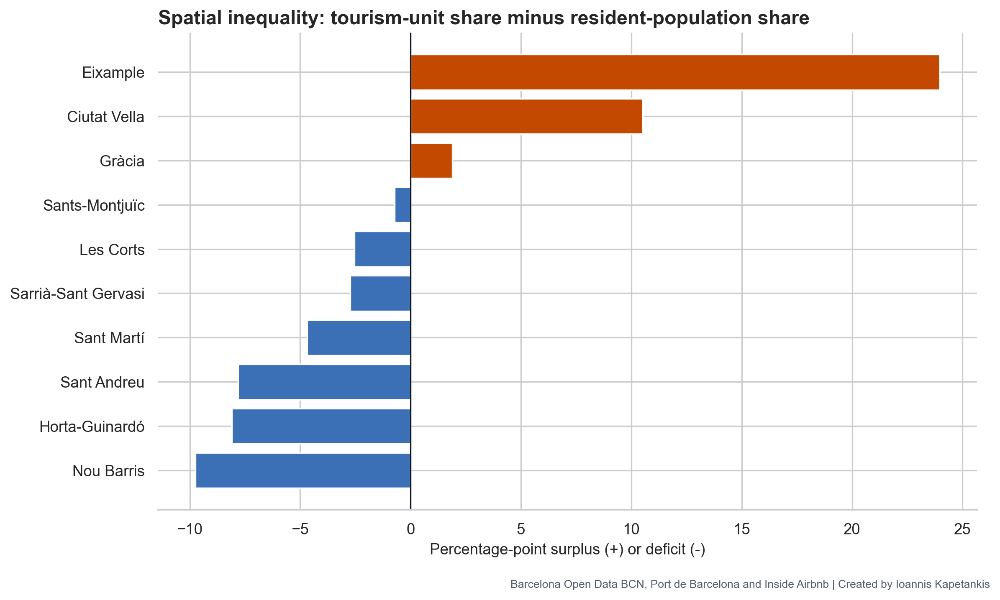
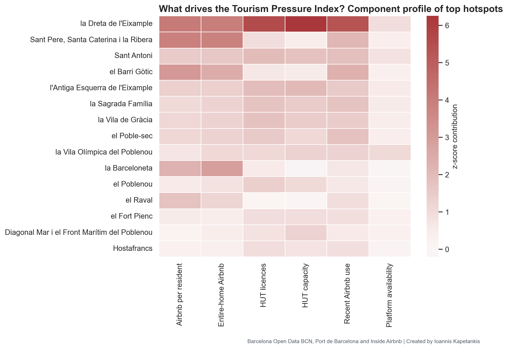
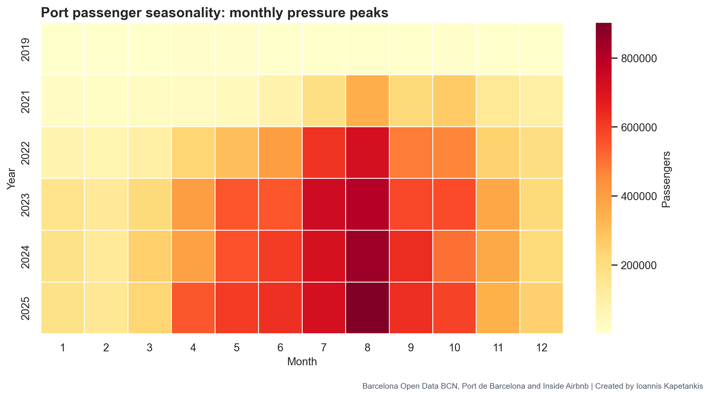
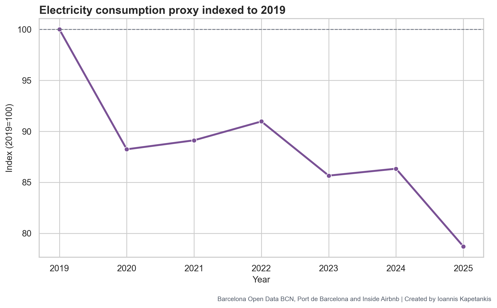

<div align="center">

# A Data-Driven Critical Appraisal of Sustainable Tourism Management in Barcelona

### Tourism Pressure, Spatial Inequality and Policy Effectiveness

**Author:** Ioannis Kapetankis  
**Assignment:** Sustainable Tourism Management  
**Case study:** Barcelona, Catalonia, Spain  
**Last project date:** 6 May 2026

[](https://www.python.org/)
[](notebooks/barcelona_tourism_sustainability_analysis.ipynb)
[](https://pandas.pydata.org/)
[](Data/)

This repository supports an academic essay evaluating whether Barcelona's sustainable tourism governance reduces measurable tourism pressure, or whether it mainly monitors, documents and administers an already concentrated urban pressure system.

</div>

---

## Research Snapshot

| Element | Summary |
|---|---|
| **Central research question** | To what extent do Barcelona's sustainable tourism policies reduce measurable tourism pressure rather than merely documenting or administratively managing it? |
| **Main argument** | Barcelona has advanced tourism-monitoring capacity, but the empirical evidence still shows strong spatial concentration, neighbourhood inequality and seasonal pressure peaks. |
| **Analytical scale** | Neighbourhood level where possible, district level where required, citywide for port and resource-pressure indicators. |
| **Core datasets** | Barcelona Open Data BCN, Inside Airbnb, Port de Barcelona, official population-denominator data. |
| **Main output** | A reproducible notebook, formal CSV evidence tables and academic figures for use in the essay. |

<p align="center">
  <a href="notebooks/barcelona_tourism_sustainability_analysis.ipynb"><strong>Open the notebook</strong></a> |
  <a href="outputs/figures/"><strong>View figures</strong></a> |
  <a href="outputs/tables/"><strong>View tables</strong></a> |
  <a href="Data/catalog/preparation_summary.json"><strong>Data preparation summary</strong></a>
</p>

---

## Headline Evidence

The analysis does not treat tourism pressure as a simple count of tourists. It evaluates pressure relative to resident population, spatial concentration, platform accommodation, licensed tourist housing, port seasonality and available environmental proxies.

| Finding | Evidence | Interpretation |
|---|---:|---|
| Highest Tourism Pressure Index score | `100.0/100` in la Dreta de l'Eixample | One neighbourhood is an extreme hotspot rather than just one high-pressure case among many. |
| Second highest TPI score | `55.9/100` in Sant Pere, Santa Caterina i la Ribera | There is a large gap between the highest-pressure neighbourhood and the next tier. |
| Highest Airbnb intensity | `52.6` listings per 1,000 residents in la Dreta de l'Eixample | Platform pressure is visible when measured against resident population. |
| Eixample tourism-unit surplus | `+23.97` percentage points above its population share | Tourism accommodation is concentrated beyond what population distribution would imply. |
| Top-10 HUT concentration | `65.8%` of HUT pressure in the top neighbourhoods | Licensed accommodation regulation has not produced spatial balance. |
| Port passenger peak pressure | Peak-to-average monthly ratio up to `2.77` | Annual visitor totals can hide short-term carrying-capacity stress. |

---

## Visual Overview

The strongest academic visual result is the neighbourhood Tourism Pressure Index map. It shows that Barcelona's tourism pressure is not evenly distributed across the city; it clusters in central, symbolic and highly accessible neighbourhoods.


<details open>
<summary><strong>Read the map interpretation</strong></summary>

The choropleth shows a central-city pressure pattern. La Dreta de l'Eixample is the clearest hotspot, followed by Sant Pere, Santa Caterina i la Ribera, Sant Antoni, el Barri Gotic, l'Antiga Esquerra de l'Eixample, la Sagrada Familia, la Vila de Gracia, el Poble-sec, la Vila Olimpica del Poblenou and la Barceloneta. This supports the essay argument that citywide averages can hide very uneven neighbourhood exposure.

</details>

---

## Figure Gallery

| Tourism Pressure Index | Highest-pressure neighbourhoods |
|---|---|
|  |  |

| Accommodation pressure | Spatial inequality |
|---|---|
|  |  |

| Composite pressure components | Cruise and port seasonality |
|---|---|
|  |  |

| Policy framework | Environmental proxy |
|---|---|
|  |  |

<details>
<summary><strong>Open the complete figure list</strong></summary>

| Figure | File |
|---|---|
| Tourism Pressure Index: highest-pressure neighbourhoods | [outputs/figures/01_tpi_top_neighbourhoods.png](outputs/figures/01_tpi_top_neighbourhoods.png) |
| Airbnb pressure: top neighbourhoods | [outputs/figures/02_airbnb_pressure_top_neighbourhoods.png](outputs/figures/02_airbnb_pressure_top_neighbourhoods.png) |
| HUT pressure: top neighbourhoods | [outputs/figures/03_hut_pressure_top_neighbourhoods.png](outputs/figures/03_hut_pressure_top_neighbourhoods.png) |
| Tourism Pressure Index choropleth | [outputs/figures/04_tpi_choropleth.png](outputs/figures/04_tpi_choropleth.png) |
| Airbnb pressure choropleth | [outputs/figures/05_airbnb_pressure_choropleth.png](outputs/figures/05_airbnb_pressure_choropleth.png) |
| HUT pressure choropleth | [outputs/figures/06_hut_pressure_choropleth.png](outputs/figures/06_hut_pressure_choropleth.png) |
| Policy-priority typology map | [outputs/figures/07_policy_priority_typology_map.png](outputs/figures/07_policy_priority_typology_map.png) |
| HUT versus Airbnb scatterplot | [outputs/figures/08_hut_vs_airbnb_scatter.png](outputs/figures/08_hut_vs_airbnb_scatter.png) |
| Tourism Pressure Index component heatmap | [outputs/figures/09_tpi_component_heatmap.png](outputs/figures/09_tpi_component_heatmap.png) |
| District spatial inequality | [outputs/figures/10_district_spatial_inequality.png](outputs/figures/10_district_spatial_inequality.png) |
| District pressure heatmap | [outputs/figures/11_district_pressure_heatmap.png](outputs/figures/11_district_pressure_heatmap.png) |
| Concentration Lorenz curve | [outputs/figures/12_concentration_lorenz_curve.png](outputs/figures/12_concentration_lorenz_curve.png) |
| Airbnb room type by district | [outputs/figures/13_airbnb_room_type_by_district.png](outputs/figures/13_airbnb_room_type_by_district.png) |
| Port recovery and cruise share | [outputs/figures/14_port_recovery_and_cruise_share.png](outputs/figures/14_port_recovery_and_cruise_share.png) |
| Port monthly seasonality heatmap | [outputs/figures/15_port_monthly_seasonality_heatmap.png](outputs/figures/15_port_monthly_seasonality_heatmap.png) |
| Port peak pressure ratio | [outputs/figures/16_port_peak_pressure_ratio.png](outputs/figures/16_port_peak_pressure_ratio.png) |
| Electricity consumption index | [outputs/figures/17_electricity_consumption_index.png](outputs/figures/17_electricity_consumption_index.png) |
| HUT quarterly trend | [outputs/figures/19_hut_quarterly_trend.png](outputs/figures/19_hut_quarterly_trend.png) |
| Air-quality monitoring coverage | [outputs/figures/20_air_quality_monitoring_coverage.png](outputs/figures/20_air_quality_monitoring_coverage.png) |
| Policy priority summary | [outputs/figures/21_policy_priority_summary.png](outputs/figures/21_policy_priority_summary.png) |
| DPSIR policy-effectiveness chain | [outputs/figures/22_dpsir_policy_effectiveness_chain.png](outputs/figures/22_dpsir_policy_effectiveness_chain.png) |

</details>

---

## Essay Context

This project supports the essay titled:

> **A Data-Driven Critical Appraisal of Sustainable Tourism Management in Barcelona: Tourism Pressure, Spatial Inequality and Policy Effectiveness**

Barcelona was selected because it is a major urban destination in the European Union with unusually rich public data on tourist accommodation, platform rentals, port passengers, population denominators, energy consumption and environmental monitoring. It also has a mature sustainable-tourism policy framework, including the Sustainable Tourism Strategy 2023-2025. That makes it a useful case for asking a harder question than whether policy exists: **does policy measurably reduce pressure?**

The essay's core claim is that Barcelona is not unmanaged. It has strong policy language, administrative capacity and data infrastructure. The critical issue is that monitoring capacity is not the same as pressure reduction. The evidence produced here points to concentrated accommodation pressure, platform-rental pressure, district-level spatial inequality, seasonal port peaks and environmental indicators that require cautious proxy interpretation.

<details>
<summary><strong>Essay structure supported by this repository</strong></summary>

| Essay section | Evidence produced here |
|---|---|
| Introduction | Research problem, destination selection, evaluation question and argument. |
| Conceptual and analytical framework | Triple Bottom Line, DPSIR, carrying capacity and indicator-based policy evaluation. |
| Methodology | Dataset architecture, spatial units, temporal units, indicator formulas and limitations. |
| Policy context | Sustainable tourism strategy, accommodation regulation, platform pressure, visitor-flow management and environmental monitoring. |
| Empirical analysis | TPI hotspot map, HUT concentration, Airbnb intensity, district inequality, port seasonality and electricity proxy evidence. |
| Critical evaluation | Policy strengths, policy-performance gaps and the difference between measuring pressure and reducing pressure. |
| Recommendations | Neighbourhood thresholds, platform auditing, TPI-based targeting, pressure-adjusted value metrics and better environmental attribution. |
| Stakeholder analysis | Governance actors, residents, platforms, accommodation owners, port authority, visitors, local businesses and NGOs. |

</details>

---

## Conceptual Framework

The analysis combines three academic lenses.

| Framework | Role in the project | How it is operationalised |
|---|---|---|
| **Triple Bottom Line** | Frames tourism sustainability as economic, environmental and social/cultural balance. | Avoids evaluating success only through visitor growth, accommodation supply or economic return. |
| **DPSIR** | Links tourism demand drivers to pressures, states, impacts and policy responses. | Connects accommodation platforms, HUT supply and port flows to spatial and seasonal pressure indicators. |
| **Carrying capacity** | Treats capacity as a composite pressure system rather than a single tourist threshold. | Uses neighbourhood pressure ratios, concentration diagnostics, port peaks and environmental proxies. |


---

## Methodology

The project uses a quantitative, indicator-based approach. Instead of counting tourism activity only in absolute terms, it builds ratios that show pressure relative to resident population and spatial exposure.

### Data Architecture

| Source | Use in the analysis | Example outputs |
|---|---|---|
| Barcelona Open Data BCN | Licensed tourist housing, administrative units, population, energy and air-quality metadata. | HUT indicators, population denominators, electricity index, air-quality coverage. |
| Inside Airbnb | Platform accommodation, entire-home listings and recent review activity. | Airbnb pressure, entire-home pressure, room-type profiles. |
| Port de Barcelona | Passenger traffic and monthly seasonality. | Port recovery index, peak-pressure ratio, seasonality heatmap. |
| Prepared local catalogue | Reproducibility and dataset traceability. | Dataset inventory, preparation report, preparation summary. |

### Indicator Formulas

```text
Tourist housing pressure = HUT licences / resident population x 1,000

Airbnb pressure = Airbnb listings / resident population x 1,000

Entire-home Airbnb pressure = entire-home Airbnb listings / resident population x 1,000

Tourism-unit surplus = tourism unit share of city total - population share of city total

Tourism Pressure Index = standardised composite pressure score rescaled from 0 to 100
```

The composite Tourism Pressure Index combines multiple pressure vectors so that neighbourhoods can be compared across a shared scale. It is designed for policy prioritisation, not for causal proof.

---

## Empirical Findings

### 1. Tourism Pressure Is Spatially Concentrated


La Dreta de l'Eixample records the highest Tourism Pressure Index score in the analysis. The gap between the top neighbourhood and the second-ranked neighbourhood suggests a severe hotspot structure, not simply a smooth gradient of pressure across the city.

### 2. Platform Accommodation Reinforces Existing Pressure Geographies


Airbnb pressure and HUT pressure overlap in many central neighbourhoods. This is important for policy evaluation because formal regulation of licensed tourist housing does not automatically neutralise platform-rental pressure.

### 3. District Inequality Is Central To The Sustainability Problem


Eixample and Ciutat Vella carry a tourism-unit share that is much higher than their population share. Other districts remain comparatively residential. This means citywide averages can understate the lived pressure experienced in central districts.

### 4. Cruise And Port Pressure Is Seasonal


Port passenger pressure is not just an annual-volume question. Peak months can create short-term stress that is hidden when arrivals are averaged across a year.

### 5. Environmental Evidence Must Be Treated Carefully


Electricity and air-quality data are used as environmental pressure proxies, not as direct proof of tourism impact. Stronger causal claims would require more precise spatial crosswalks, time-series pollutant data and better attribution between tourism activity and resource use.

---

## Policy Evaluation Matrix

| Policy area | Measurable indicator | Observed signal | Limitation | Recommendation |
|---|---|---|---|---|
| Licensed tourist housing controls | HUT licences and HUT places per 1,000 residents | Spatial concentration remains visible in the latest HUT snapshot. | Quarterly snapshots do not directly show individual opening or closure events. | Evaluate caps against neighbourhood pressure, not only citywide totals. |
| Short-term rental management | Airbnb listings, entire-home listings and reviews per 1,000 residents | Airbnb pressure can be compared directly with population denominators. | Inside Airbnb is a market scrape, not an official register. | Cross-check platform listings with licence and enforcement records. |
| Cruise and port visitor management | Annual passengers and monthly peak-to-average ratio | Port pressure is strongly seasonal and citywide. | Passenger counts do not show where visitors spend time inside the city. | Link port scheduling policy to neighbourhood footfall and mobility data. |
| Environmental service capacity | Electricity consumption by postcode and air-quality monitoring coverage | Resource-pressure proxy is measurable but cannot support strong causal claims alone. | No full postcode-to-neighbourhood crosswalk or pollutant time series is included here. | Add official postcode boundaries and air-quality observations before causal policy claims. |

---

## Stakeholder Analysis

| Stakeholder | Power | Exposure | Main interest | Conflict logic | Indicator link |
|---|---|---|---|---|---|
| Barcelona City Council | High | Medium | Regulation, social balance, tax return | Resident pressure versus tourism economy | Policy actions, HUT controls |
| Turisme de Barcelona / DMO | High | Medium | Destination competitiveness and sustainability positioning | Growth logic versus pressure reduction | Strategy, certification, promotion |
| Residents | Medium | High | Housing affordability, liveability, noise, crowding | Social carrying capacity versus visitor economy | TPI, Airbnb pressure, spatial inequality |
| HUT owners | Medium | Medium | Licence value, rental income, regulatory stability | Private return versus housing pressure | HUT per 1,000 residents |
| Airbnb hosts and platforms | High | Medium | Platform supply, occupancy, flexibility | Informal growth versus enforceable control | Airbnb listings, entire-home share |
| Hotels | High | Low-medium | Occupancy, regulated competition, average daily rate | Formal sector versus platform sector | Accommodation mix |
| Port authority and cruise operators | High | Medium | Passenger volume, port revenue, scheduling | Volume growth versus peak pressure | Port seasonality, peak-month ratio |
| Tourists | Low | Low | Access, price, experience quality | Consumption freedom versus local limits | Demand concentration |
| Local businesses | Medium | Medium | Footfall, spending, survival | Revenue dependence versus overtourism costs | Spatial hotspots |
| Environmental and social NGOs | Medium | Medium | Accountability, conservation, resident rights | Ecological and social limits versus growth | Air quality, energy, SDG links |

---

## Data-Driven Recommendations

| Recommendation | Why it follows from the evidence | Practical policy use |
|---|---|---|
| Neighbourhood-level carrying-capacity thresholds | TPI results show that pressure is sharply concentrated. | Set pressure caps by neighbourhood rather than relying only on citywide regulation. |
| Platform-data auditing and enforcement | Airbnb and HUT pressure overlap but are not identical. | Compare platform listings with licence registers and enforcement records. |
| Tourism Pressure Index for policy prioritisation | Composite pressure better captures multilayered exposure than one indicator alone. | Use TPI to rank intervention urgency and track change over time. |
| Pressure-adjusted tourism value | Economic success metrics can ignore social and spatial costs. | Evaluate tourism value after accounting for resident exposure and public-service pressure. |
| Improved environmental attribution | Electricity and air-quality data are useful but limited proxies. | Add pollutant observations, postcode boundary crosswalks and tourism-linked resource-use models. |

---

## Repository Guide

| Path | Purpose |
|---|---|
| [notebooks/barcelona_tourism_sustainability_analysis.ipynb](notebooks/barcelona_tourism_sustainability_analysis.ipynb) | Main analysis notebook with data loading, profiling, indicator construction, maps, figures and exported tables. |
| [scripts/prepare_datasets.py](scripts/prepare_datasets.py) | Dataset preparation script. |
| [scripts/polish_figures.py](scripts/polish_figures.py) | Figure polishing script for academic presentation. |
| [scripts/download_datasets.ps1](scripts/download_datasets.ps1) | Dataset download helper script. |
| [Data/catalog/dataset_manifest.csv](Data/catalog/dataset_manifest.csv) | Local file inventory for downloaded datasets. |
| [Data/catalog/preparation_report.csv](Data/catalog/preparation_report.csv) | Dataset preparation and validation report. |
| [Data/catalog/preparation_summary.json](Data/catalog/preparation_summary.json) | Summary of prepared-data status. |
| [outputs/figures/](outputs/figures/) | Exported maps, charts and academic figures. |
| [outputs/tables/](outputs/tables/) | Exported CSV tables for evidence, appendices and essay writing. |

<details>
<summary><strong>Open the table catalogue</strong></summary>

| Table | File |
|---|---|
| Airbnb room type by district | [outputs/tables/airbnb_room_type_by_district.csv](outputs/tables/airbnb_room_type_by_district.csv) |
| Analysis dataset overview | [outputs/tables/analysis_dataset_overview.csv](outputs/tables/analysis_dataset_overview.csv) |
| Concentration diagnostics | [outputs/tables/concentration_diagnostics.csv](outputs/tables/concentration_diagnostics.csv) |
| Dataset inventory | [outputs/tables/dataset_inventory.csv](outputs/tables/dataset_inventory.csv) |
| District pressure summary | [outputs/tables/district_pressure_summary.csv](outputs/tables/district_pressure_summary.csv) |
| District spatial inequality | [outputs/tables/district_spatial_inequality.csv](outputs/tables/district_spatial_inequality.csv) |
| Electricity index | [outputs/tables/electricity_index.csv](outputs/tables/electricity_index.csv) |
| Generated figure index | [outputs/tables/generated_figure_index.csv](outputs/tables/generated_figure_index.csv) |
| Method notes and limitations | [outputs/tables/method_notes_and_limitations.csv](outputs/tables/method_notes_and_limitations.csv) |
| Policy evidence scorecard | [outputs/tables/policy_evidence_scorecard.csv](outputs/tables/policy_evidence_scorecard.csv) |
| Policy indicator matrix | [outputs/tables/policy_indicator_matrix.csv](outputs/tables/policy_indicator_matrix.csv) |
| Policy priority typology | [outputs/tables/policy_priority_typology.csv](outputs/tables/policy_priority_typology.csv) |
| Port peak pressure | [outputs/tables/port_peak_pressure.csv](outputs/tables/port_peak_pressure.csv) |
| Port recovery index | [outputs/tables/port_recovery_index.csv](outputs/tables/port_recovery_index.csv) |
| Top Airbnb neighbourhoods | [outputs/tables/top_airbnb_neighbourhoods.csv](outputs/tables/top_airbnb_neighbourhoods.csv) |
| Top electricity postcodes | [outputs/tables/top_electricity_postcodes.csv](outputs/tables/top_electricity_postcodes.csv) |
| Top HUT neighbourhoods | [outputs/tables/top_hut_neighbourhoods.csv](outputs/tables/top_hut_neighbourhoods.csv) |
| Top TPI neighbourhoods | [outputs/tables/top_tpi_neighbourhoods.csv](outputs/tables/top_tpi_neighbourhoods.csv) |
| TPI component profile | [outputs/tables/tpi_component_profile.csv](outputs/tables/tpi_component_profile.csv) |

</details>

---

## How To Reproduce The Analysis

1. Open [notebooks/barcelona_tourism_sustainability_analysis.ipynb](notebooks/barcelona_tourism_sustainability_analysis.ipynb).
2. Select a Python environment with the required analysis libraries installed.
3. Run the notebook from top to bottom.
4. Review exported CSV evidence tables in [outputs/tables/](outputs/tables/).
5. Review exported academic figures in [outputs/figures/](outputs/figures/).

Core Python libraries used by the notebook:

```text
pandas
numpy
matplotlib
seaborn
tabulate
```

---

## Data Governance Note

Raw source files and very large CSV datasets are intentionally not treated as the main GitHub-facing evidence layer. The repository focuses on reproducible code, prepared summaries, exported tables, figures and documentation. This keeps the project readable and avoids pushing sensitive or oversized data to GitHub.

---

## Limitations

| Limitation | Implication |
|---|---|
| The Tourism Pressure Index is an available-data composite indicator. | It supports hotspot identification and policy prioritisation, but it is not causal proof of policy success or failure. |
| Inside Airbnb is a platform scrape. | It should be compared with official licence and enforcement data before making strong regulatory claims. |
| Port data is citywide. | It identifies temporal pressure peaks but not exact movement through neighbourhoods. |
| Electricity data is a proxy. | It should be interpreted cautiously because non-tourism drivers also affect consumption. |
| Air-quality files provide limited monitoring context. | Strong environmental sustainability claims require more complete pollutant observations and spatial harmonisation. |
| Geographic boundaries and time periods differ between datasets. | The analysis is strongest for pattern recognition, pressure hotspots and evidence-informed policy critique. |

---

## References

Ajuntament de Barcelona (2016) *Tourist housing in the city of Barcelona* [Dataset]. Open Data BCN. Available at: https://opendata-ajuntament.barcelona.cat/data/en/dataset/c748799e-1079-44b1-9e60-88d936a3fe70 (Accessed: 6 May 2026).

Ajuntament de Barcelona (2018) *Air quality measure stations of the city of Barcelona* [Dataset]. Open Data BCN. Available at: https://opendata-ajuntament.barcelona.cat/data/en/dataset/qualitat-aire-estacions-bcn (Accessed: 6 May 2026).

Ajuntament de Barcelona (2019) *Measured air pollutants by the air quality measurement stations of the city of Barcelona* [Dataset]. Open Data BCN. Available at: https://opendata-ajuntament.barcelona.cat/data/en/dataset/contaminants-estacions-mesura-qualitat-aire (Accessed: 6 May 2026).

Ajuntament de Barcelona (2020) *Administrative units of the city of Barcelona* [Dataset]. Open Data BCN. Available at: https://opendata-ajuntament.barcelona.cat/data/en/dataset/20170706-districtes-barris (Accessed: 6 May 2026).

Ajuntament de Barcelona (2022) *Electricity consumption by postal code, economic sector and time interval in the city of Barcelona* [Dataset]. Open Data BCN. Available at: https://opendata-ajuntament.barcelona.cat/data/en/dataset/consum-electricitat-bcn (Accessed: 6 May 2026).

Ajuntament de Barcelona (2023) *Population by age* [Dataset]. Open Data BCN. Available at: https://opendata-ajuntament.barcelona.cat/data/en/dataset/pad_mdbas_edat-1 (Accessed: 6 May 2026).

Ajuntament de Barcelona (2024) *Barcelona seeks to boost harmony between tourism and the city through a new government measure*. Available at: https://turismesostenible.barcelona/en/news/106/barcelona-seeks-to-boost-harmony-between-tourism-and-the-city-through-a-new-government-measure (Accessed: 6 May 2026).

Barcelona Turisme (2023) *Sustainable Tourism Strategy 2023-2025*. Available at: https://barcelonaturisme.com/uploads/web/bst/EstrategiaTurismeSostenibleBarcelonaTurisme23-25_ENG.pdf (Accessed: 6 May 2026).

Inside Airbnb (2025) *Barcelona, Catalonia, Spain: listings, calendar, reviews and neighbourhood data* [Dataset]. Available at: https://insideairbnb.com/get-the-data/ (Accessed: 6 May 2026).

Observatori del Turisme a Barcelona (2025) *Individuals data base. Tourist profile and habits in Destination Barcelona 2024* [Dataset]. Available at: https://observatoriturisme.barcelona/en/documentacio/base-de-dades-individus-perfil-i-habits-del-turista-a-la-destinacio-barcelona-2024/ (Accessed: 6 May 2026).

Observatori del Turisme a Barcelona (2025) *Excursionists data base. Tourist profile and habits in Destination Barcelona 2024* [Dataset]. Available at: https://observatoriturisme.barcelona/en/documentacio/base-de-dades-excursionistes-perfil-i-habits-del-turista-a-la-destinacio-barcelona-2024/ (Accessed: 6 May 2026).

Observatori del Turisme a Barcelona (2025) *Individuals tables. Tourist profile and habits in Destination Barcelona 2024* [Dataset]. Available at: https://observatoriturisme.barcelona/en/documentacio/taules-dindividus-perfil-i-habits-del-turista-a-la-destinacio-barcelona-2024/ (Accessed: 6 May 2026).

Observatori del Turisme a Barcelona (2026) *Barcelona tourism activity report 2024* [Report]. Available at: https://observatoriturisme.barcelona/en/documentacio/barcelona-tourism-activity-report-2024/ (Accessed: 6 May 2026).

Observatori del Turisme a Barcelona (2026) *2025 Annual Report of the Barcelona Tourism Observatory: Data 2024* [Report]. Available at: https://pre-webunwto.s3.eu-west-1.amazonaws.com/s3fs-public/2026-03/2025%20Annual%20Report%20of%20the%20Barcelona%20Tourism%20Observatory%20%28Data%202024%29.pdf?VersionId=arCwANkHQSbtHI1jlSqgn484cqemdawM (Accessed: 6 May 2026).

Port de Barcelona (n.d.) *Passenger traffic statistics* [Dataset]. Open Data Port de Barcelona. Available at: https://opendata.portdebarcelona.cat/en/dataset/estadistiques-de-trfic-de-passatgers (Accessed: 6 May 2026).

---

## Author Note

This repository was prepared by **Ioannis Kapetankis** for a **Sustainable Tourism Management** assignment on Barcelona tourism pressure, spatial inequality and policy effectiveness. It is designed to function both as a reproducible analysis workspace and as an academic evidence companion for the final essay.
